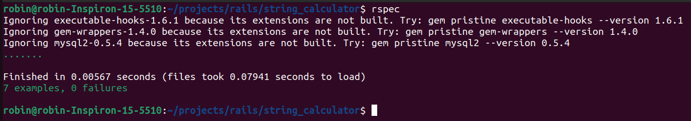

# 🧮 String Calculator - TDD Kata (Ruby)

This project implements the **String Calculator Kata** using **Ruby** and **RSpec**, following best practices for **Test-Driven Development (TDD)**.

---

## ✅ Problem Statement

Implement a method:

```ruby
def self.add(string)
```

It takes a string of numbers and returns their sum. The string may contain:

- Empty input (returns `0`)
- One or more comma-separated numbers (e.g. `"1,2"`)
- Newlines (`\n`) as valid separators
- Custom delimiters in format: `//[delimiter]\n[numbers]`
- Negative numbers raise an exception listing all negatives

---

## 🔧 How to Run the Project

### 1. Clone the Repository

```bash
git clone https://github.com/robin249/string_calculator.git
cd string_calculator
```

### 2. Install Dependencies

```bash
bundle install
```

### 3. Run Tests

```bash
rspec
```

---

## 🧪 Examples

| Input             | Output | Notes                                      |
|------------------|--------|--------------------------------------------|
| `""`             | `0`    | Empty string                               |
| `"1"`            | `1`    | Single number                              |
| `"1,2"`          | `3`    | Sum of two numbers                         |
| `"1\n2,3"`       | `6`    | Newline and comma mixed delimiters         |
| `"//;\n1;2"`     | `3`    | Custom delimiter (`;`)                     |
| `"1,-2,3"`       | ❌     | Raises: `negative numbers not allowed -2`  |
| `"-1,-3,-5"`     | ❌     | Raises: `negative numbers not allowed -1,-3,-5` |

---

## 🚀 TDD Process Followed

1. ✅ Red: Write a failing test
2. ✅ Green: Make the test pass
3. ✅ Refactor: Clean and optimize code
4. 🔁 Commit after every meaningful change

---

## 🧩 Tools Used

- Ruby `3.0.1`
- [RSpec](https://rspec.info/) for testing
- Git for version control

---

## 📸 Screenshots

> Include screenshots here showing passing test output.

---

## 📂 File Structure

```
.
├── lib/
│   └── string_calculator.rb
├── spec/
│   └── string_calculator_spec.rb
├── Gemfile
├── README.md
└── .rspec
```

---

## 📜 License

MIT © [Robin](https://github.com/robin249)